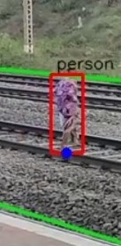
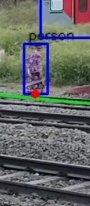

# Railway-Tresspassing-Detection-System

Project Members: \
[Harsh Ingle](https://github.com/HarIn-Inc) \
[Karthik Arumugam](https://github.com/KarthikArumugam3) \
[Yogesh Rajgure](https://github.com/YogeshRajgure)

### Ongoing Project

Person detected on railway tracks \

Person detected outside reailway tracks \

for now, this code works only on the given video files for \
maintain the folder hierarchy..
https://drive.google.com/drive/u/6/folders/1zHGJ5R5G6_RKXFDj_rUsj1xV-kFmvYXm

now exploring flask+celery and flask socketIO to be able to send the live data to flask.